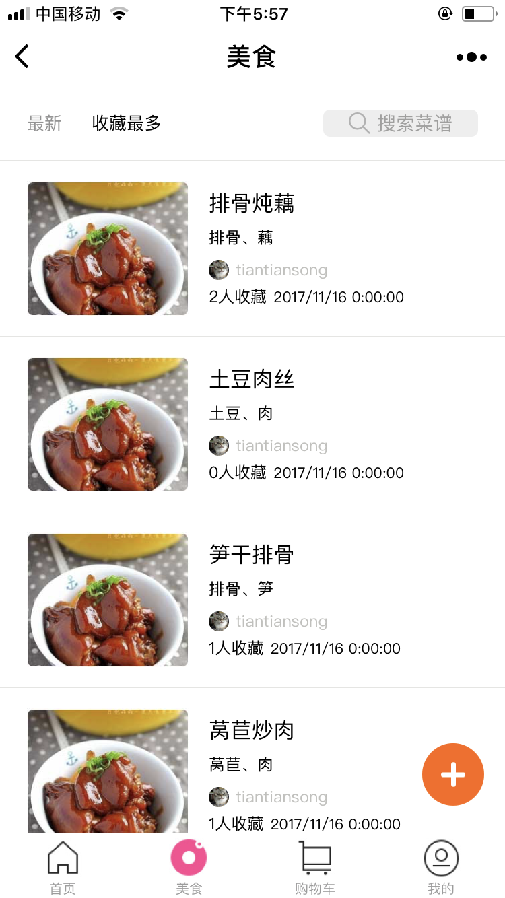
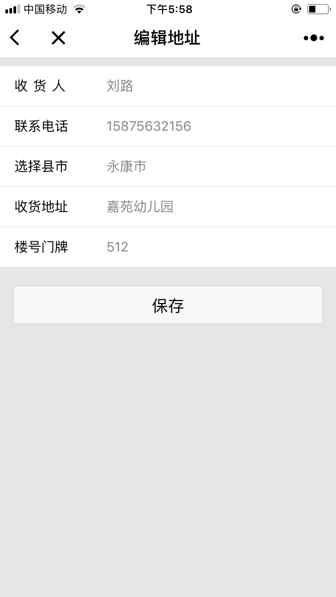

## 品丽州微信小程序前端
* FDF
* FDF
* ger

###### 项目截图

  <image src="./app-screenshots/IMG_001.PNG" style="width=40%;"></image>
  </img>

 

   </img>
   </img>
 

 

   </img>
   </img>
 

 

   </img>
   </img>
 

 

   </img>
   </img>
 

  

    </img>
    </img>
  

  {:height="50%" width="50%"}
   {:height="50%" width="50%"}
