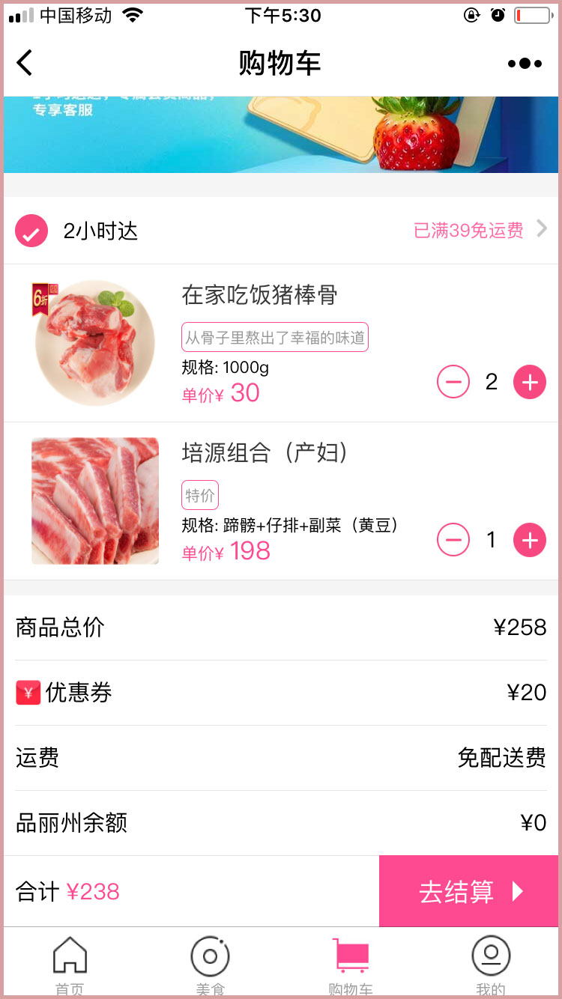
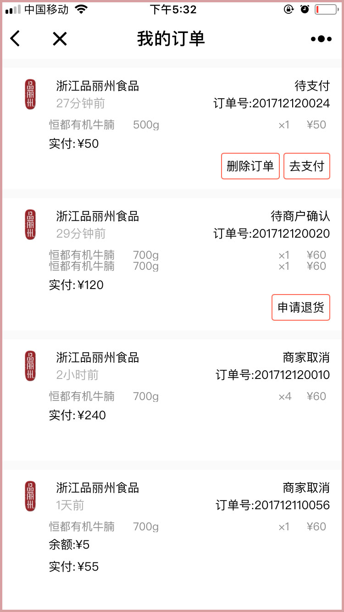
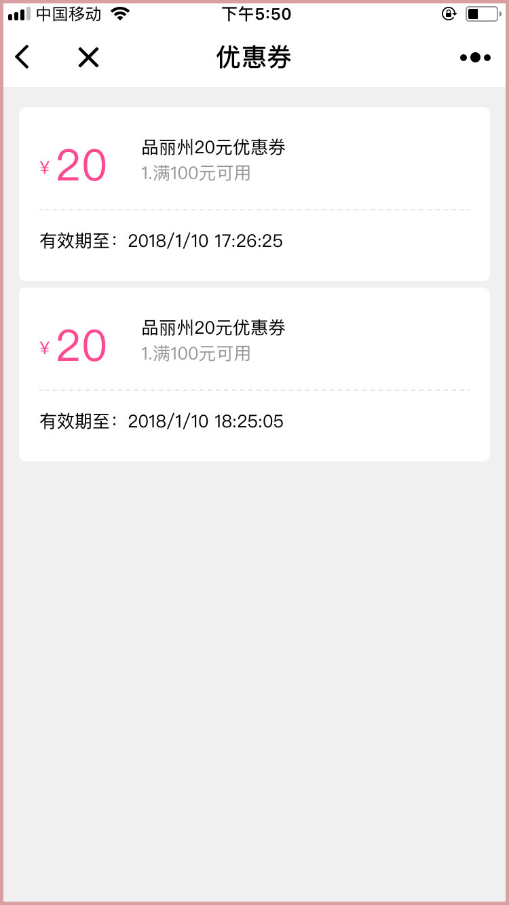
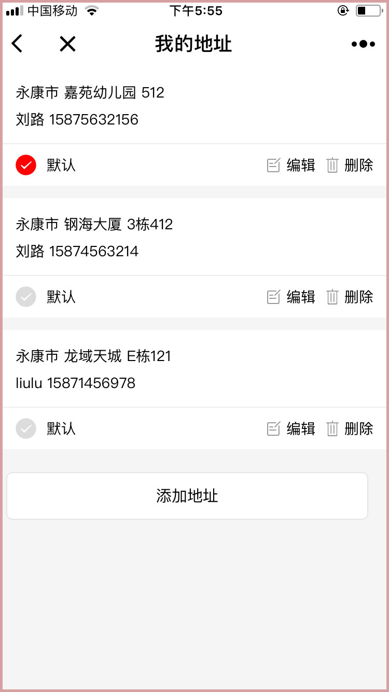
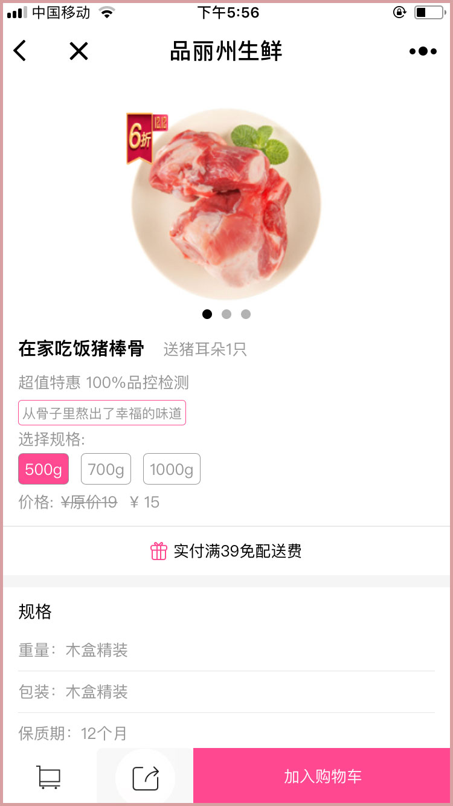
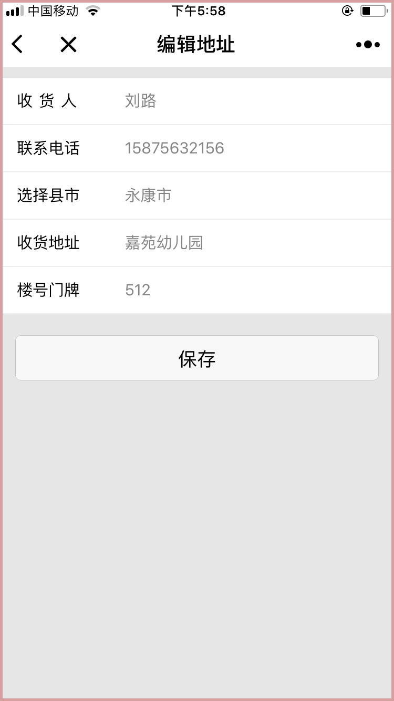
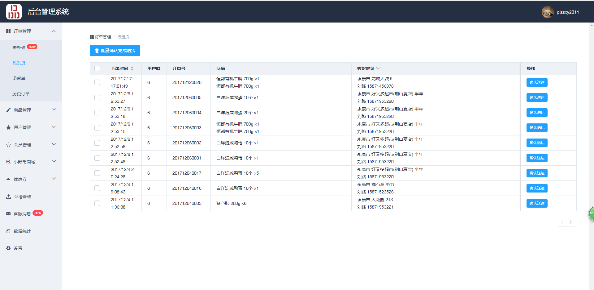
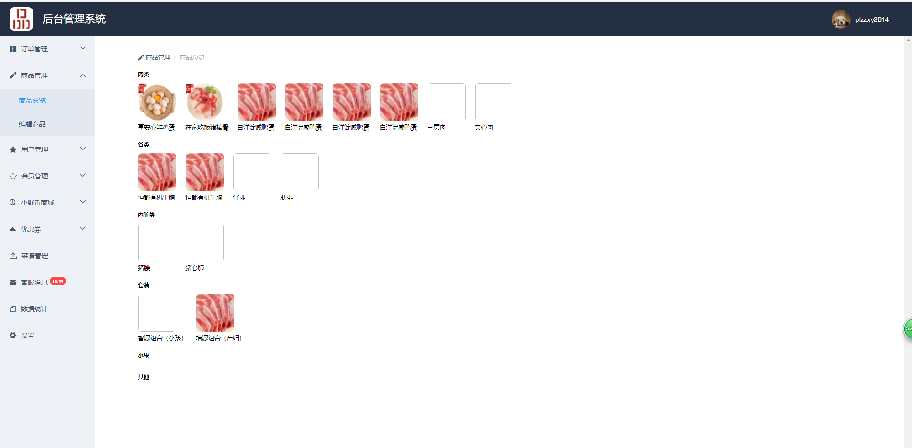
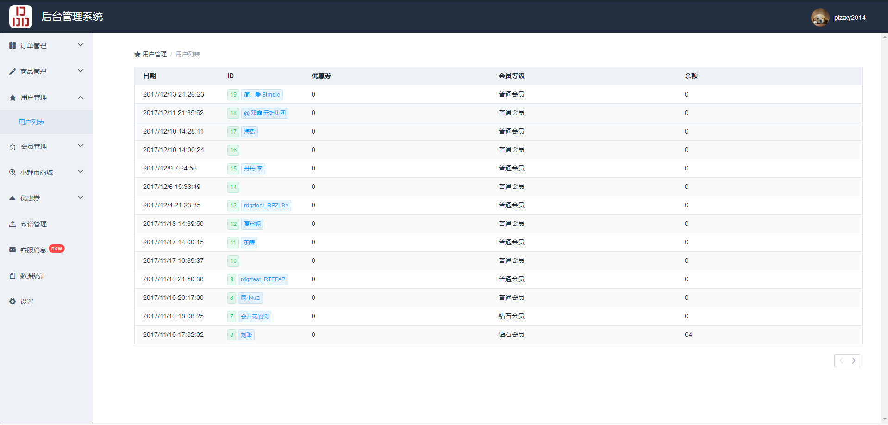
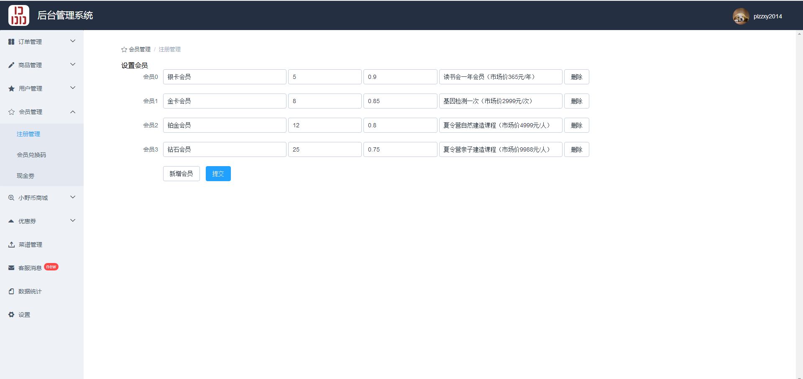

## 品丽州生鲜商城
品丽州生鲜商城是基于本地生鲜，生食肉类，衍生日常消费品，会员线下服务等在微信端的微信小程序网上商城。
##### 项目责任：
商城端与甲方沟通项目需求并书写需求文档，做出原型图和UI设计交付甲方确认。熟悉微信小程序的设计规范文档达到微信官方所倡导的良好用户体验和相关开放接口以利于商城后面的运营和推广。与后端工程师一起确定前后端接口，编写整体前端代码；微信公众平台小程序后台和商户平台的注册和配置；应小程序要求做到服务器的HTTP和TLS版本的配置和服务部署。


后台管理方面参考主流的后台管理功能界面，前端项目选型并结合自己的前端商城实际与后期运营人员的意见作出页面原型稿并确定前端框架结构。与后端工程师一起确定前后端接口并书写后台管理系统前端代码。


##### 项目描述：
* 由于小程序框架不同与传统的web端的会话管理实现和小程序启动路由钩子与小程序页面的加载路由钩子没有确定顺序，小程序相关页面加载之后还没有获取到用户的会话信息。采用框架的相关钩子函数和Pomise结合，解决了有时页面加载后还没有得到用户的会话信息。
* 前端代码的组件化与模块化，图片资源按需存放本地或请求获取尽量将代码包的体积缩小，以利于前端首次下载速度和操作，打开速度和后期维护。利用框架的倡导的wxs脚本语言和setData原理减少从逻辑层到视图层的通信，使得操作流畅性能更好。
* 做到IOS和Android等不同手机型号对于WXSS(css)渲染差异的兼容，以至于在不同系统不同品牌的手机上渲染近乎一致。
* 后端管理系统采用单页应用形式，使得像具有原生的流畅性。代码使用webpack和相关工具打包，使代码包的体积缩小利于加载速度等性能。
* 采用mock.js模拟后端数据接口，使得可以先与后端接口完成之前书写前端接口相关代码，做到迅速开发。
* 使用element UI使管理系统页面风格统一，观感良好。

##### 效果演示
###### 请微信扫以下二维码或微信搜索 ```品丽州食品```

</img>


##### 前端项目截图
<image src="./app-screenshots/IMG_001.jpg"  width=375px height=667px/>    

<image src="./app-screenshots/IMG_003.jpg" width=375px height=667px />    

<image src="./app-screenshots/IMG_005.jpg" width=375px  height=667px/>    

<image src="./app-screenshots/IMG_007.jpg" width=375px height=667px />    

<image src="./app-screenshots/IMG_009.jpg" width=375px  height=667px/>    

<image src="./app-screenshots/IMG_011.jpg" width=375px  height=667px/>    


##### 后天管理项目截图
<image src="./admin-screenshots/QQ截图001.png" width=960px height=475px />



<image src="./admin-screenshots/QQ截图003.png" width=960px height=475px />



<image src="./admin-screenshots/QQ截图005.png" width=960px height=475px />



<image src="./admin-screenshots/QQ截图007.png" width=960px height=475px />



<image src="./admin-screenshots/QQ截图009.png" width=960px height=475px />
